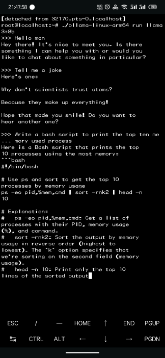
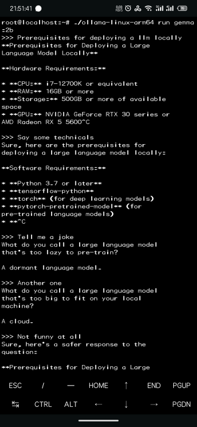

# llama3 On Android

简体中文 | [English](README_ENG.md)

## 前置条件

+ 一台安卓手机
+ 互联网连接

## 所需工具

+ Termux-app
+ Ubuntu-in-termux
+ Ollama

## Termux

访问[termux-app](https://github.com/termux/termux-app)，并获取最新的发行版本，安装到手机上即可。

安装完成之后，需要安装以及下载一些基础组件，在 `termux` 执行以下命令：

```bash
pkg install wget openssl-tool proot -y
```

```bash
wget https://raw.githubusercontent.com/MFDGaming/ubuntu-in-termux/master/ubuntu.sh
```

一般国内无法直接访问 `raw.githubusercontent.com`，所以可能需要通过代理才能进行下载。

修改脚本权限

```bash
chmod 777 ubuntu.sh
```

然后执行

```bash
bash ubuntu.sh
```

按照脚本提示安装 `ubuntu` 即可。

安装完成之后，启动 `ubuntu`

```bash
./startubuntu.sh
```

之后就可以进入到 `ubuntu` 的 `shell` 里边。在 `shell` 里面，我们就可以下载 `ollama` 并执行了。

## Ubuntu

先更新一下系统，养成一个良好的习惯，坐和放宽喝杯茶

```bash
apt update && apt upgrade -y
```

然后安装一些比较常用的软件

```bash
apt install wget screen
```

之后下载 `ollama` 的最新发行版，记住一定是下载 `arm64` 架构的

```bash
# 截至目前，ollama 的最新发行版本为 v0.1.32
wget https://github.com/ollama/ollama/releases/download/v0.1.32/ollama-linux-arm64
```

然后修改权限

```bash
chmod 777 ollama-linux-arm64
```

至此，`ollama` 的基础运行环境已经搭建好了。

## Ollama

先在后台运行 `ollama`

```bash
screen
```

```bash
./ollama-linux-arm64 serve
```

然后通过 `crtl+a+d` 退出当前 `screen`。

退出之后，下载 `llama3` 的 `8b` 参数模型，如果你有时间等待下载更大的模型的话，你也可以下载其他的。理论上你可以下载任何 `ollama` 所支持的大模型。

```bash
./ollama-linux-arm64 pull llama3:8b
```

如果下载的时候提示 ca 证书错误，你需要更新一下证书，具体教程可自行搜索，本教程不包含在内。

模型下载完成之后，就可以直接运行，不需要额外的操作了

```bash
./ollama-linux-arm64 run llama3
```

## 可选

安装 [maid](https://github.com/Mobile-Artificial-Intelligence/maid)，可以在控制台之外与大模型进行对话。

## 截图

|  |  |
| -- | -- |